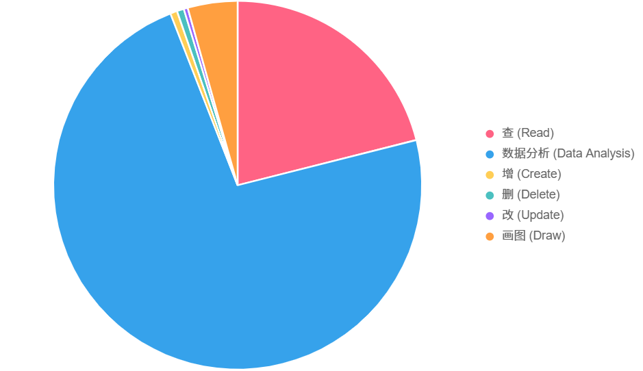

# Excel 测试数据集

## 概述

本数据集包含多个 Excel (.xlsx) 和 CSV 文件，涵盖人力资源、经济、销售、教育、社交媒体、股票交易等领域，旨在支持数据分析技能的测试与练习。每个文件关联分析任务，包括增删改查、统计汇总、筛选、排序、分组聚合和时间序列分析，适合学习数据处理和商业洞察。

## 目录

- [数据集结构](#数据集结构)
- [领域分布](#领域分布)
- [测试维度分析](#测试维度分析)
- [数据特点](#数据特点)

## 数据集结构

数据集包含 Excel 文件（如 1-2.xlsx、1-3.xlsx）和 CSV 文件（如 29ba53ce7ca43a979263ed36798f62a3.csv），关联三个 JSON 文件：

- **crud.json**: 40 条指令，涵盖增删改查任务。
- **data_query.json**: 241 条指令，聚焦查询和统计任务。
- **data_analysis.json**: 836 条指令，针对 CSV 文件的统计分析。

每条指令包括：
- **id**：唯一标识符。
- **question**：任务描述（中文或英文），明确数据分析目标。
- **concepts**：操作类型（如 增加、删除、Filtering、Summary Statistics）。
- **constraints**：任务要求，包括使用 pandas、目标列、数据处理规则（如保留两位小数）等。
- **file_name**：关联的 Excel 文件名。
- **answer**：标准答案，部分要求格式（如 "Final Answer: ..."）。

## 领域分布

数据集覆盖多个领域，示例文件如下：

| 领域                     | 示例文件                           |
|--------------------------|------------------------------------|
| 员工与人力资源数据       | 1-2.xlsx, 3-5.xlsx                |
| 销售与订单数据           | 1-4.xlsx, 4-9.xlsx                |
| 经济与消费数据           | 1-1.xlsx                          |
| 客户与市场数据           | 2-6.xlsx                          |
| 股票与金融数据           | 5-2.xlsx                          |
| 教育与学生数据           | 2-2.xlsx, 3-3.xlsx                |
| 社会与文化数据           | Titanic.xlsx, 2015–2019.xlsx      |
| 资产与采购数据           | 1-5.xlsx, 4-3.xlsx                |
| 食品与农业数据           | winequality-red.xlsx              |
| 会议与预约数据           | 2-7.xlsx, 4-5.xlsx                |
| 物流与运输数据           | 1-9.xlsx, 4-4.xlsx                |
| 房地产数据               | boston.xlsx, 4-7.xlsx             |
| 健康与医疗数据           | 4-5.xlsx                          |
| 气象与运输数据           | 29ba53ce7ca43a979263ed36798f62a3.csv |

## 测试维度分析

### 1. 操作类型分布

基于 JSON 文件的 `concepts`，结合增删改具体数量：

| 操作类型   | 指令数量 | 占比 (%) |
|------------|----------|----------|
| 查 (Read)  | 241      | 21.37%   |
| 数据分析   | 836      | 74.18%   |
| 增 (Create)| 7        | 0.62%    |
| 删 (Delete)| 7        | 0.62%    |
| 改 (Update)| 4        | 0.35%    |

- **查**: 包括筛选、统计、排序，测试查询能力。
- **数据分析**: 复杂统计、相关性、分组等，占比最高，测试分析能力。
- **增**: 插入新数据（如添加员工、地区），占比低。
- **删**: 删除特定数据（如删除低评分记录），占比低。
- **改**: 修改数据（如更新薪资、GDP），占比最低。

### 2. 具体操作细分

| 具体操作            | 指令数量 | 占比 (%) |
|---------------------|----------|----------|
| Summary Statistics  | ~300     | ~30%     |
| Filtering           | ~200     | ~20%     |
| Max/Min/Lookup      | ~150     | ~15%     |
| Aggregation/Sum     | ~100     | ~10%     |
| Count               | ~80      | ~8%      |
| GroupBy             | ~50      | ~5%      |
| Distribution/Binning | ~40      | ~4%      |
| Correlation         | ~20      | ~2%      |
| Time Series         | ~15      | ~1.5%    |
| Data Insertion      | 7        | 0.62%    |
| Data Deletion       | 7        | 0.62%    |
| Data Modification   | 4        | 0.35%    |

.png)

- **Summary Statistics**：如平均值、中位数，占比最高，反映基础统计分析需求。
- **Filtering**：筛选特定条件的数据，占比高，测试条件查询能力。
- **Max/Min/Lookup**：查找最大/最小值或对应记录，常见于排行榜场景。
- **Aggregation/Sum**：求和操作，常见于财务、库存等场景。
- **Distribution/Binning**：分箱统计，测试数据分布分析能力。
- **Correlation**：相关性分析，较少但难度较高，测试高级统计能力。
- **GroupBy**: 按类别汇总，如班级成绩。

### 3. 难度等级分布

基于问题设计，难度根据步骤复杂性判断（简单：1-2 步，中等：3-5 步，困难：6+ 步或多表操作）：

| 难度等级 | 指令数量 | 占比 (%) |
|----------|----------|----------|
| Easy     | ~600     | ~52%     |
| Medium   | ~400     | ~36%     |
| Hard     | ~200      | ~12%      |

.png)

- **Easy**: 简单统计、计数、单条件筛选（如平均薪资、GDP 低于 10000 的地区数），1-2 步，适合初学者。
- **Medium**: 分组、排序、时间序列、组合条件筛选（如按部门汇总薪资、GDP 增长率），3-5 步，适合中级用户。
- **Hard**: 复杂操作，如多表关联、增删改后验证、相关性分析（如修改 GDP 后查询最高地区），6+ 步，测试高级技能。

## 数据特点

- **格式**: Excel (.xlsx) 和 CSV，适合 pandas、Excel 处理。
- **多样性**: 覆盖人力资源、经济、销售、教育等场景。
- **任务类型**: 增删改查、统计、筛选、排序、分组、时间序列。
- **复杂性**: 含多表结构、缺失值，考验数据清洗能力。
- **答案规范**: `data_analysis.json` 要求 "Final Answer: ..." 格式。
